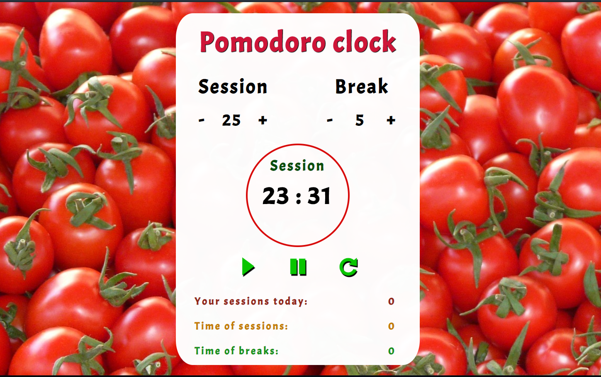

# Pomodoro clock
> Simple app that counts time of doing something and breaks between activity times. It was made to improve my JS knowledge. It is also useful when I learn new things. 

## Table of contents
- [Pomodoro clock](#pomodoro-clock)
  - [Table of contents](#table-of-contents)
  - [General info](#general-info)
  - [Screenshots](#screenshots)
  - [Technologies](#technologies)
  - [Status](#status)

## General info
Pomodoro clock was created to learn some new JS features, later, as I learn new things about JavaScript, I rewrite it practically from zero.
App is very useful when I study. 

## Screenshots

## Technologies
* Javascript
* CSS
* HTML
* 
## Status
_finished_
Everything that was planed for this project is already done.